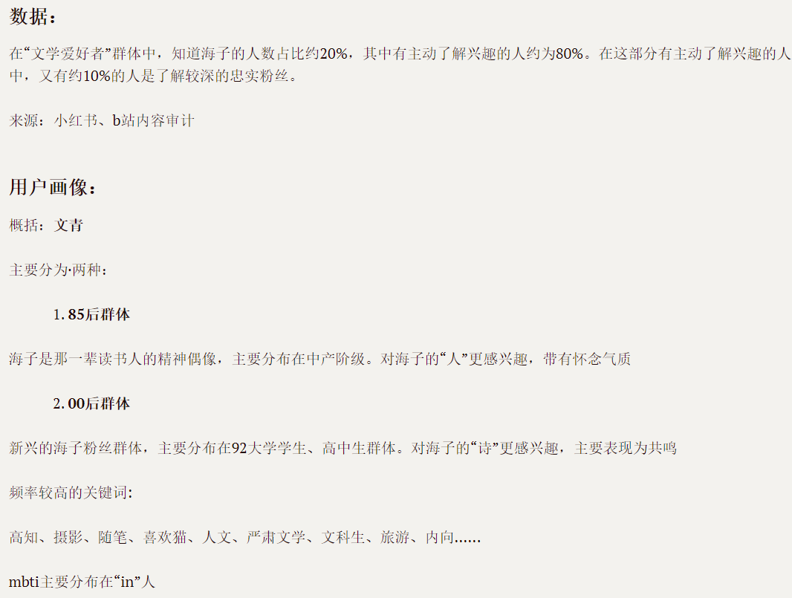

#  海子的诗——海子个人纪念网站的搭建


## 起因

因为从初中开始便很喜欢海子，所以在大学进入了计算机这一专业后，便一直有一个为海子搭建一个网站的想法。恰好在25年末，在网上查找海子诗集的资料时，发现了huhaitai大佬搭建的网站，整理了现存最全的海子发表过的作品，第一次刷到的时候真的很惊喜，还顺藤摸瓜找到了大佬的邮箱发了一封邮件。。后来发现，因为这个网站大概是十几年前搭建的，所以很多现代化的功能都没有。于是这个网站便诞生了，初心是更好的整理和搜集海子或关于海子的作品，让喜欢海子的人可以在网上获得更方便、舒适的阅读体验。

**在线地址**：[haizipoemes.zenus10.com](https://haizipoemes.zenus10.com)

## 用户是谁

刚开始做的时候根本没有这个意识，后来因为开始接触一些产品经理的知识，且在开发的过程中遇到了一些迷茫的时候，便找了一个时候停下开发流程，亡羊补牢式的去思考这个问题。

给我的感觉就是产品定位决定目标用户，用户需求又影响了产品定位...不搞清楚目标就很容易偏航，搞清楚最根本的定位才能决定什么该做，什么不该做，什么该做加法，什么该做减法。

我先开始做的是尝试做目标调研，恰好我之前发过一个小红书，内容就是海子相关，有14w+的浏览量，5000+赞评，样本量是很足的，我便在一个晚上视奸了评论区近五百个人的主页。然后再去各种平台，主要是小红书和b站查询了海子相关的内容。。

粗略的结果：




最后定结论的时候还是考虑了自己的初心，即把这个网站当作一个数据库一样的东西，社区和评论一开始不如不做，冷启动就好。

---

## Why Astro

技术选型是唯一一个我没怎么纠结的环节...直接套用博客的技术栈了

Astro：

1. **零JS默认**。诗歌档案是纯内容站点，不需要客户端状态管理，不需要SPA路由。构建时编译成HTML。
2. **Content Collections**。每首诗是一个`.md`文件，有title、year、type等元数据。Astro用Zod schema在构建时校验，手滑写错年份直接报错
3. **岛屿架构**。大部分页面纯静态，只在搜索和筛选的地方注入JS。

其他依赖：UnoCSS做原子化辅助、Fuse.js做客户端模糊搜索、Netlify部署。没有用重型框架。

我之前的博客也是Astro + Netlify，在部署上不用再重新踩坑，对我这个快速的项目来说很方便了。

---

## Design Decisions

自己先在figma上画出原型图，删删改改好几版，最后拍板了决定要页面跳转型，现代化感比较强。设计风格想要留白感、呼吸感重的设计效果，所以只用了这一个主题色(#600000)点缀。根据自己审美画了hero页~-o-~

字体: 标题用宋体（SimSun / Songti SC），正文用Satoshi配合宋体回退。

---

## 一些技术细节

**虚拟滚动**。250+首诗全渲染到DOM里移动端会卡。手写了一个轻量虚拟滚动：普通状态每项40px，搜索带摘要时60px，上下各5条overscan，requestAnimationFrame节流。滚动位置和筛选状态存sessionStorage，刷新不丢失。没用第三方库。

**全文搜索**。Fuse.js做客户端模糊匹配，搜索结果提取匹配位置前后各20字符作为摘要高亮展示。输入框150ms debounce，搜索时列表切换双行模式（标题+摘要），清空后恢复单行。

**长诗目录**。《河流》《传说》这种长诗需要导航。桌面端左侧sticky目录栏带阅读进度条，移动端改成右下角浮动按钮+侧滑面板。目录自动提取标题层级，点击平滑滚动，scroll-margin-top避开固定导航栏。

**响应式**。呵呵呵一开始完全没做移动端的响应式设计。。。想着做完桌面端再做移动端，可以减少一点修改的工程量。到最后才开始吭哧吭哧改移动端。

---

## 内容工程

艰难爬爬爬。。。爬过来之后又艰难地一点点校对。没有想到这一趴才是最耗费时间的啊！

```
src/content/poems/
├── short/          # 按年份子目录
│   ├── 1983/
│   ├── ...
│   └── 1989/
├── long/           # 长诗
├── sun/            # 太阳·七部书
└── essay/          # 文论
```

每首诗一个`.md`文件，YAML front matter写元数据。

---

## 反思

两周的开发周期里，说实话也学到了挺多的

最开始是一时心血来潮想做一个海子的网站，带着一股盲目的乐观，脑海里也挺清晰的，就是要一个干净的收录这些诗歌的网站，符合我审美就好。由于之前有一些aicoding的经验教训，这次便先自己画了原型图，照猫画虎写了一份类似prd的文档，设定了框架和功能。出了demo之后又进行了许多的微调。总体是一个设计+开发+测试的流程，我原先是觉得没问题的，没想到有大问题...

一个最大的问题是，产品定位不清晰，而我的想法又太多变。own开发的一个问题就是自己一会儿想要这个，一会儿又想改成那个，到底是一个工具还是一个情绪价值？加这个功能会不会偏离产品定位？我越推进流程越觉得我一开始的想法太乐观了，完全是出于直觉做事，没有数据支撑后续就会怀疑自己，一怀疑就会动摇根本，我中途有好几次都想着“干脆推翻重来吧”。。更何况越到开发的晚期沉没成本越大，再大改难上加难。教训就是先想好你的情怀与定位是什么？市场和用户要什么？到底要做什么？要达到什么？**先想好再做事。**


---

## Tech Stack

| 组件 | 技术                           | 说明                      |
| ---- | ------------------------------ | ------------------------- |
| 框架 | Astro 5.x                      | 零JS默认，静态站点生成    |
| 样式 | CSS Variables + UnoCSS         | 手写设计系统 + 原子化辅助 |
| 搜索 | Fuse.js                        | 客户端模糊全文搜索        |
| 内容 | Markdown + Content Collections | Git驱动的内容管理         |
| 部署 | Netlify                        | 自动构建 + CDN            |

---

