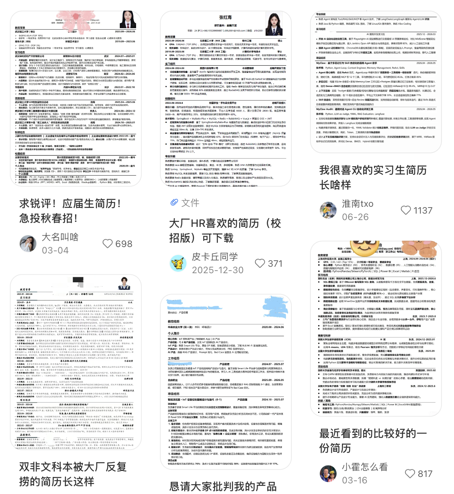

## 前言

最近有一些朋友来问我是怎么找实习的，我总是不知道怎么合适地回复...便想着找时间写一篇总结，正好可以沉淀一下在找实习的这个过程中积累的一些经验。

首先介绍一下我自己的情况：我是从26年初决定要找实习，并且确定了想走的方向是**产品岗**。之后在上半年入职京东，做c端的ai产品；同年暑假一直到现在入职字节，做b端的ai产品。在这里主要是讲述一些通用的经验，便不对产品这个岗位本身作详细的阐述，后续可能会再出一篇详细的产品岗介绍。

本篇博客只为贡献一些经验，给同样在找实习路上有迷茫的同学提供力所能及的帮助。如果你看我不顺眼，那就点击右上角那个叉叉，我就在你的互联网世界消失了知道吗？

## 怎么确定自己想做的方向

我想做产品的初心其实挺简单的：因为我想本科就业，我不想写代码，我想赚钱。于是我便盯上了产品岗，因为以下几点：

为什么选择产品岗？

1. **薪资**：随着ai浪潮来临，越来越多的互联网大厂提倡产研同薪，即产品岗与研发岗同等薪资。虽然在校招的时候开的包还是不如研发岗，但ssp也可以开到40-50w，还是非常可观的，且实习工资和研发是真的等列的，如字节京东都可以开到500/d（但腾讯还在扣扣地200/d🤫）

2. **工作内容**：据我个人在工作中的体验来看，产品相对于其他岗位会拥有更多的话语权与自主权，会更多的动用到脑子（？）。大家都说在大厂里工作就是打螺丝钉，既然都是当螺丝钉为什么不给自己多争取些喘息空间呢。！开玩笑的，**首先**我认为产品工作中很看重的就是决策能力、抽象能力，以及大家经常提及的“产品sense”，我觉得这些能力不仅是工作能力，也是可复用到生活里的能力，包括很多大厂的产品经理到最后的归宿常常都是去自主创业，我认为工作中积累的产品经验绝对是创业底气的来源之一；**再者**也会锻炼你的社会化水平，也就是沟通能力，产品需要与研发、运营、算法、设计等等各方人员沟通，接触到的社交面也会更广，也更有机会认识更多优秀的同期或前辈，我觉得这其实是一个价值很大的隐形优势点；**最后**对比研发来看，比起接完需求盯着代码看蹬ai，还是创造性的工作对我来说更有意思吧！

3. **氛围**：这一点其实对我很重要。如果把研发组比作北航电科北邮，那产品组就是北大人大川大，懂我意思吗。在京东同期的实习生都是年轻优秀的姐姐，在字节也有许许多多性格不同但都很优秀的女性前辈，大家都超会说话的啦（）（叠甲：这里并没有说男性不好的意思，我mt和同期也都是很优秀、情商很高的男性），只是这个占比对我个人而言会让我感觉更放松，也更能放开自己去学习与进步，所以这种氛围也会成为我选择产品的一个很大的原因。

但这时候可能会有人会说：同学同学，这些都是工作之后才能体验到的东西吧！我还没有实习怎么确定自己要干什么呢！

我认为需要**确定自己优势与定位**，比如小a的前端能力很强是9分，后端能力是5分那他可以去投前端；小b的前端是7分，后端也是7分，那他可以去试试全栈开发；小c的代码能力综合起来只有3分，但他熟悉ai开发，加上ai可以加分到7分，而且小c比较爱vibecoding开发产品，那小c可以去试试产品...等等等。**一定要熟悉自己的优势，对应优势去找自己的定位**。

比如我一开始找产品实习的优势，其实就是因为我算是计算机科班出身，会aicoding东西，这在学校里是大家习以为常的事情，但是在没有专业限制的产品赛道，尤其是ai产品赛道里，其实是一个很大的加分点～所以大家可以在网上**多了解自己感兴趣行业的就业形势**，比如agent开发工程师、ai builder......该出手时就出手哦～🥳

## 零实习怎么准备项目

我在找实习的时候面临的第一个问题就是：我的简历该怎么写？我什么项目也没有啊？

没有项目那就做。🫪

我当时是准备了两个项目：一个是海子的那个网站，优势是可以体现出我会用figma画原型以及会aicoding；一个是Preuser，一个to pm的agent开发，这个其实对我的帮助最大，后来两次被大厂约面基本上都是因为这个项目（github地址： https://github.com/zenus10/PreUser  ，感兴趣的可以看一下）

这个项目其实是我一时兴起做的，用cc开发只用了不到一周，但是它出乎意料地很受面试官欢迎，我后来知道了原因，就是因为这个项目**与岗位吻合**，他叠加了PM + agent 两个buff，然后对于大部分的ai产品来说有点万金油般的存在...

面试官或hr在筛简历的时候，相比于直觉里的工作能力、实习经历等，起更关键的决定性作用的还是**与岗位的匹配度**。这里有一个小邪修：如果你有学长学姐内推渠道，那你可以打听一下这个团队现在大致在做什么，比如在做b端的workflow，那你就做一个workflow项目，面试官一看哇你简直就是我的命中注定（不是）；同样的，如果你有特别心仪的岗位，也可以根据jd去准备你的项目定位...

如果还没有项目想法的话，那还有一个方法（也是我当时的方法。）那就是去**逛github🤓**。

我平时主要关注这几个板块：explore、一些专门收集项目的库以及主页好友动态。我的Preuser的灵感就是来自于当时刷主页刷到了一个项目叫做microfish，一个分发agent来模拟真人从而实现舆情分析的一个项目，既然如此，为什么不可以分发agent来模拟用户从而实现产品分析呢？故而我的项目诞生了...但是也不是提倡大家完全抄袭（反正笔者个人是不太提倡完全抄项目的），只能说一定要灵活运用好思维迁移能力，以及伟大的开源精神🥸

## 简历怎么写与如何投递

关于这个简历问题我真的有话要说...

### 外观

曾经有两个小伙伴让我帮忙看看他们的简历，其水平我在这里不作透露，但是其外观实在是惨不忍睹，感觉一眼就可以凭借花花绿绿的版头和排版看出是出自于某个神秘软件的某某模板。我痛心疾首地对其中一个小伙伴说太丑了改改吧，他说哪里丑了我觉得挺好看的啊。！我说你觉得好看有啥用hr觉得好看才有用吧！。

简历是给hr看的，在写简历之前一定要先去小红书上至少搜一下高分简历长什么样子，再说内容的事情吧好不好！🫸**一定不要用奇怪的模板！不要有奇怪的叛逆心口牙！**

我曾看过一位同事的boss直聘后台，两天可以收到800+简历......就像高考语文作文阅卷一样，一份试卷留的时间只有不到半分钟，如果你的字写的不好印象分直接就会扣分；筛简历会更严酷，据一位hr朋友的原话是：凭什么给你耐心呢（）

这里给大家放个截图预览一下

### 内容

说完外观，再来说内容。

如果按照上面的模板顺着写下来就行，基本上就是**学校信息、实习经历、项目经历、其他经历 / 创作经历、技能补充**这些模块，顺序上一般也是从上到下按重要程度排。对于产品岗来说，实习经历和项目经历通常是最核心的，其他内容更多是作为补充，帮助别人更完整地认识你。

还有一点就是：**没有含金量的经历，写上去不一定加分，反而可能扣分。** 简历不能写成“我做过什么都要告诉你” 的流水账文档，而是一个展现与岗位的匹配度。比起来把简历塞满（？），还是注意整体的逼格嗯

具体到每一段经历怎么写，我个人是比较推荐按 **STAR 法则** 来组织的，也就是写清楚你当时面对的情境、承担的任务、采取的行动，以及最后拿到的结果，如果一个经历干的活比较碎的话，可以先按板块分开，然后再分别用star法则。（用处就是看着比较专业，hr更好晒重点）

另外，有些厂会比较看重**数据优先。** 就是比起来空话，尽量把成果量化出来，比如提升了多少百分比、覆盖了多少用户、迭代了多少版本、产出了多少篇内容、拿到了多少播放 / 阅读 / 转化.....当然实在没什么有含金量的数字那也不用硬凑）

在排版上，也可以适当用**加粗**去强调一些亮眼信息，比如核心项目、关键成果、特别漂亮的数据，或者某个很匹配岗位的关键词。但也一定要注意节制，**不要把一整页加得到处都是重点**，那最后就等于没有重点。

如果你有自己的**博客地址、GitHub、作品集**，也都可以放上去，尤其是当这些内容能作为你能力的外延证明时，会很加分。再比如你如果有一些比较突出的经历 —— 像自媒体、创业、做过社群、独立运营过项目，或者拿过一些有 title 的身份，比如某某训练营优秀学员、某某比赛获奖、某个社区核心成员之类 —— 也完全可以整理一下放进简历（这里的某某指的是腾讯、字节、百度这些title，不是指学校组织之类的...不过工作室倒是可以写上去）

很多时候，虽然这些内容不一定直接等于岗位经验，但它们能侧面说明你的表达能力、执行力、影响力，或者某种特别鲜明的个人特质。只要组织得当，都有机会成为你的加分项🤓比如我曾经做美工以及接稿，就被现在的mt派了做设计flow的活...

简历其实就是包装自己。必要的时候可以请豪上身。🥷

### 投递

我个人当时主要就是在 **Boss 直聘** 上投的，反正就是一直投，多投就行了。。

我的做法是，先把自己的简历截图下来，投递的时候直接发**简历图片 + 打招呼语**。然后写打招呼语的时候，会直接把自己简历里的亮点压缩进去，比如学校背景、做过什么项目、项目结果怎么样、有没有相关经历、有哪些比较突出的数据等等，其实就是把简历又复述一遍，强迫此信息进入hr大脑🤓，然后再标上自己能实习六个月、立即到岗就ok

我当时基本上每天都会投到上限。这个阶段其实不用太焦虑，找实习本来就是一个高频筛选、反复碰壁的过程，很多岗位你觉得自己很合适，最后也不一定有回音；很多你原本没抱太大希望的岗位，反而可能给你发起约面...我刚开始投的那几天每天就焦虑得不行，但是只要简历没问题，2-3天就可以有中小厂甚至大厂约面的

还有一个点就是**尽量优先投那些显示 “在线” 或者近期活跃的岗位。** 因为很多岗位虽然挂在那里，但人可能根本不看，有些岗位甚至早就不招了，只是没撤掉而已...

## 面试准备

### 自我介绍

面试里的自我介绍一般说完“面试官您好，我是xxx，来自电子科技大学软件工程专业”之后，不能写成流水账，最好直接把**你的优势以及和这个岗位最匹配的地方**写出来，比如你是一个有产品思维的人，是执行力很强的人，是懂技术的 AI 产品苗子，表达和抽象能力都不错的人......等等，给自己安人设说是。

然后还可以给面试官**埋钩子**，比如你提一句自己做过一个特别贴近岗位方向的项目，或者提一句自己在某段经历里拿到过不错的结果，对方后面大概率就会顺着这个点继续问，勾引一波懂我意思吗🤫

自我介绍最好提前准备好一个通用版本，然后根据岗位jd微调。

### 项目深挖

面试题基本上都是项目深挖题，像你为什么这么做、你当时是怎么判断的、有没有遇到分歧、最后结果怎么样、如果重来一次你会怎么改之类的...最好对简历上写的每一句话都准备好被深挖的准备🙌

我一般的做法是把**简历、目标岗位的 JD，再加上网上能找到的相关面经**一起丢给 AI，让它帮你整理出一份可能会被问到的问题题库。提前看几遍心里面基本上也就能有个数

### 其他因素

其实和面试官有没有眼缘是很重要的事情👅，我们也不能把握就是说，啊我和他一下子就特别聊得来（我之前也遇到过有朋友和面试官聊起来股票特别聊得来，直接进腾讯了，牛而逼之），但这种事听天命尽人事吧，我们言行尽量装一点，有自信但谦虚人设装起来，聪明爱动脑子点子多人设装起来，单纯向往公司人设装起来，然后注意一下自己的外表形象吧就是，也不用特别好看，但人都是有爱美之心的，而且邋里邋遢的也会被感觉不重视呢

## 放在最后

写到这里，这篇关于找实习的博客也差不多该结束了。

我从开始找实习到现在也不过半年，但回头看这一路，成长真的如抽丝剥茧般难熬。从一开始的盯着电脑焦虑，看着简历抓狂，到后来一点点做项目，改简历，刷尽了网上关于找实习的信息，每天做梦都是在模拟面试，慢慢地，我找到了第一段大厂，不久后又跳到了原先梦寐以求的字节，一切像梦一样。有时候我好像也忘了当时自己的迷茫、焦虑和心烦意乱，但最近阴差阳错，我又想起来好多当时的事情，故而又整理了一下自己的经验和思路

的确，在很多个深夜改简历、刷招聘软件、看别人面经、等消息等到心烦意乱的时候，人是很容易怀疑自己的，觉得是不是自己还不够好，是不是别人都比自己更清楚方向，是不是这条路太卷了，只有更优秀的人才能走下去...但其实很多时候不是这样的，也许大家都在装而已。！蒽

如果你刚好也在这个阶段，我希望这篇文章多少能给你一点点帮助。虽然我说了很多“邪修”，但找实习说到底好像也没有什么捷径。可能就是想清楚自己要什么，然后一点点把手里的东西准备好、尽量把握住机会。也许一时不会有什么成果但是嗯总会有的！不用太着急，也不用太早给自己下结论，有些结果会晚一点来，但并不代表它不会来。

希望你最后能去到一个还不错的地方，遇到还不错的人，做着暂时还愿意投入热情的事情。也希望等你之后回头看这段日子的时候，会发现那些曾经让你焦虑、失眠、反复内耗的时刻，原来也真的构成了今天的你。

