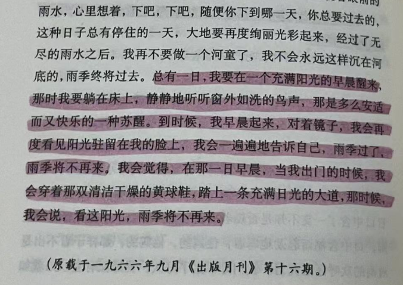

# 2025年度

> 我们似乎总会在某一年，爆发性地长大，爆发性地觉悟，爆发性地知道某个真相，让原本没有什么意义的时间的刻度，成了一道分界线。

## 前言

逼着自己写年度总结的时候才来得及将这一年的零零碎碎全都拢起来看。如此这般回过神来，才有一种奇怪的感觉：“哦，原来发生过这么多事了啊”

我感觉有一部分的我已经死了，又感觉有一部分的我是新生的。还有一部分骨头是复苏的，或许在疯狂长出血肉...有一种克苏鲁的美感。说起来，确实找来找去也找不到一个能把所有发生的事情串起来的东西，所以虽然一直有写年度的念头，但迟迟不知道从哪里下笔。

点燃了一个香薰，放了一个白噪音，挑战精神稳定、乐观地写完2025年度总结。

这对我来说充满了痛苦、悔恨、混乱、动荡、迷茫与悲伤的一年。

## 问卷

上次删删减减，最终还是没写出来什么。偶然间刷到问卷形式的，我想可能会给我提供一些灵感。遂决定以这种形式总结一下。

### 01.如果用一种天气形容我的2025，那是?

**雨**。

"...不知道是雨下的频繁，还是因为那些重要的事都和雨有关。那些记忆如今被掀开来也依然觉得湿淋淋，即便干了，也像泡了水的书本一样，纸张全荡起波纹，难以平复。..."

雨不是从年初就开始下的，年初是干燥的，是那种灰白得发慌的阴天。当时我和p整天整夜呆在一起，在快乐感里无所事事，在新鲜感里飘飘欲仙。后来放了寒假，在老家呆了一段时间后p要去北京实习，北京离邯郸不算远，坐绿皮火车也才五个半小时，我记得p在安顿好北京的住处后就迫不及待地来找我见面，这几乎是我这么大第一次带人来家里住。

感觉很奇妙，由于一些原因，我的卧室是一个在我内心深处无比私密的一个地方，一直以来像一个缄默的秘密一样被我和赵一雯守护的很好，连我的父母进来都会感到极其不自在。突然带一个外来的人来，竟然也不是很奇怪，只是又有点偏题。长话短说。

带p在我老家的小县城玩了三四天（因为突发肠胃炎所以迫不得已待久了一点），后面去邯郸玩了一天，然后到了北京，应该没过几天便去了天津玩，去看了海，放了烟花棒，很浪漫。回程之前去打了一对戒指。之后又回了北京。

忘了因为什么，大抵又是那些——现在看起来老生常谈——但当时或许还比较新鲜的话题吵了起来，我摔门而出，随地找了一个单元楼门口的台阶坐下了。我记得那天的月亮，特别亮特别亮，显得夜空都晴朗，我点了一根中南海，看了一会儿月亮，就鬼使神差把它对准到月亮下面，烟雾袅袅地升起，像魂，花魂，寒塘渡鹤影，冷月葬花魂，我想起出租车司机说这片地方原先是公主坟。

烟静静地飘着，但是并不阴森，像是一场等了很久的梦，等到之后的很多个时刻，我都会想起那天晚上的月亮。

我开始认同石头记是一场红楼梦。

雨从二月下到四月，六月，十月或者十二月。

二月底回到学校之后，原因不展开说了，我是一个人在一间宿舍里。那段时间的记忆不太清晰了，我也搞不明白，只能在翻看相册的·时候拼凑出来一些零零碎碎的事情，三月初的时候好像还算正常，忘了出于什么心理，可能本能地想对抗空虚感，干了很多杂七杂八的事情，成都的天也基本上都是阴沉沉的，好像从三月底就开始有些“病变”，原因有些复杂，或许别的问题下会想出答案。然后是四月。

那段时间对我来说就是一场连绵不断的阴雨，窗户外的绿叶是幽湿的，红瓦墙是潮湿的，荧光绿色的四件套是阴湿的，宿舍的混凝土地和铁桌椅是湿冷的，齿轮都生了锈，一切歇斯底里脱出口都会在雨里消散，说什么也无用，做什么无用，唉，把人变得越来越沉默，像一台也生了锈的机器，机械地重复着越来越承担不起的崩溃和重组。

那段时间的文字记录在微博上比较多，原本粘贴了过来，但想了想还是删除了。

最后是5.29发的一篇稍微温和些的

>   唉。开开心心收纳了半天桌子，开着暖暖的灯光，看着都是承载着幸福回忆的小物件真的好开心。我刚来成都的时候什么也没有，待的再久也感觉这里不是我属于的地方，现在慢慢地越来越习惯了。   
> 只是还有很多东西我都没有习惯，上课人际学习宿舍，这些东西我逃避了几乎一年，一想到这些，就像是看到收拾完的桌子之外的，地上的那些杂乱的东西一样，心里空空的，显得一开始的开心也不是滋味。我还是好累，当人类，类类的。今天去摸护食怪，它在睡觉，我的手还没有碰到它呢，眼睛都没有睁开就开始喵喵叫。当时风凉凉的，我穿着我喜欢的棕色长袖，我是暖和的。不敢开心，想哭   
> 我受够了小心翼翼地活着，受够了懦弱，受够了逃避了，可是它们在最开始保护了我，我的糟糠之妻   
> 下雨天的时候我蹲在椅子上抽烟，顺便把窗户打开，外面的深绿色的树叶和褐色的墙瓦湿成一团，漫过来的空气让我的耳根都发凉。   
> 我看着窗户上的倒影，倒影里我的头发是白的，火光若隐若现，深绿色的树叶和我混成一团，扯地连天。我想我一边窝窝囊囊，一边又学了一堆坏习惯。我不想在这里，可这就是我的十八岁，我躲不进台大的杜鹃花丛。狭小的宿舍间是灰色的，命运也就在这里等着我，陪着我。

后来又发生了很多事情，那段时间的回忆也好似离我越来越远，像一场模糊的梦；之后尽管有时会心血来潮想要写一些、说一说，却发现总是话到嘴边就停住了；对它的态度也模糊，有时候会很刻薄，有时候又会沉默。

也许有些记忆就是处于一个尴尬的位置，不适宜收藏，又不能忘。

我曾经尝试像网上主流说的那样去“祭奠”痛苦，正视它们，安慰自己说这一切都会过去的，说一些你经历过那么多痛苦已经很棒了，我心疼你诸类的话，也曾找一些心理学的术语来解释我的痛苦，或是干脆用堂吉柯德式的想法试图去容纳它们，可惜的是，这么操作一通下来我还是很痛苦，甚至更加云里雾里。

于是乎我便发现了，我生来的痛苦便不是渴求安慰和怜惜。用一通软话来变相地承认自己的软弱对我来说更是无济于事，反而像用热水浸泡本就生锈的金属一般。看看那时的我是什么样的呢？我简陋、局促、不得安宁、格格不入，“酝酿出一份巨大的悲哀却流不出几行眼泪...全面坦露自己的软弱，捶胸顿足，小丑般无理取闹。可万物充耳不闻。”

“...我无数遍讲诉自己的孤独，又讲诉千万人的千万种孤独。越讲越尴尬，独自站在地球上，无法收场。”

沉浸在痛苦里是愚蠢的，逃避是懦弱的，用各种手段去美化愚蠢和懦弱是令人的灵魂痛苦的，因为我身体的火车从来不会错轨。它允许大雪、风暴、泥石流和荒谬，但是绝不再允许背叛

因为是雨，所以在这里用喜欢的三毛的《雨季不再来》中的这段作为结尾：

雨季不会再来了，我对自己说。

